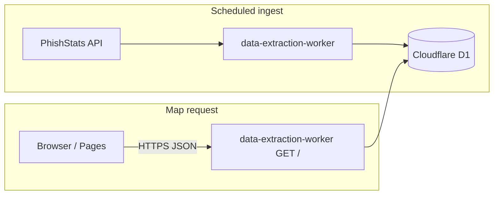

# ShowMeTheVillain

<p align="center">
  
</p>

**ShowMeTheVillain** (proposal title **Phish N’ Heat**) is a **capstone Software Engineering** project for the **Computer Science** program at the **University of Wisconsin–Green Bay (UWGB)**. It is submitted in partial fulfillment of the Software Engineering course project requirements. **Faculty advisor:** Dr. Ahsan.

The application is a **global phishing threat map**: an interactive **Plotly** density map with filters for **threat level**, **malicious actor** (brand/host context), **country**, and **ISP**. It helps visualize where reported phishing-related activity clusters geographically, using public telemetry ingested into **Cloudflare D1** and served through a **Cloudflare Worker**.

---

## Project overview

| | |
| --- | --- |
| **Institution** | UWGB — Computer Science |
| **Course context** | Capstone / Software Engineering team project |
| **Repository app name** | ShowMeTheVillain |
| **Proposal / documentation name** | Phish N’ Heat |
| **Primary data store** | Cloudflare **D1** (`phishing_links`, optional `map_grid_cells` aggregation) |
| **Map API** | TypeScript Worker — [`backend/data-extraction-worker`](backend/data-extraction-worker) |
| **Public UI** | Static site — [`frontend/`](frontend/) (Plotly + HTML/JS), hosted on **Cloudflare Pages** in production |
| **Optional dev backend** | **FastAPI** in [`backend/`](backend/) — calls **PhishStats** directly with caching (no D1); useful when you are not running the extraction Worker locally |

**Team (from project proposal):**

- **Bryon Cobb** — GitHub, hosting, software architecture  
- **Thomas Lovesee** — Python backend, database, SQL  
- **Ethan Christman** — API handling, parsing, data shapes  
- **Matthew Kabat** — networking, front-end integration  

---

## What you see in the UI

- Full-height **density map** under a dark toolbar.
- **Filters**: threat level, malicious actor, country, ISP (filtering is **client-side** after one batch load).
- **Status line**: total points loaded vs. how many match the current filters.
- **About** page: [`frontend/about.html`](frontend/about.html) — course context, team, architecture summary, references.

Default map batch size: **3,000** points (`/?limit=3000` against D1 for the Worker path). Adjust via [`frontend/index.html`](frontend/index.html) meta `worker-map-query` or FastAPI query params if needed.

---

## Architecture (production path)



1. **Ingest** — The **data extraction Worker** runs on a schedule, pulls batches from **PhishStats**, and **upserts** into D1 (`phishing_links`).
2. **Map API** — **`GET /`** on the same Worker reads D1 (raw rows or optional **grid** mode from `map_grid_cells`) and returns a **JSON array** of map points: `lat`, `lon`, `intensity`, `name`, `threat_level`, `company`, `country`, `isp`.
3. **Frontend** — [`frontend/index.html`](frontend/index.html) fetches that JSON (no PhishStats calls from the browser). **`data-source=worker`** and **`api-base`** point at the Worker’s HTTPS URL in production.

**CI note:** [`.github/workflows/deploy.yml`](.github/workflows/deploy.yml) deploys the **Python** Worker stub ([`frontend/entry.py`](frontend/entry.py)), the **data-extraction-worker**, runs [`frontend/scripts/patch_pages_meta.py`](frontend/scripts/patch_pages_meta.py) to rewrite **`api-base`** / **`data-source`** for Pages, then deploys **`./frontend`** to Cloudflare Pages.

| Piece | Role |
| --- | --- |
| [`frontend/index.html`](frontend/index.html) | Plotly map, filters; data URL from `<meta>`, URL query overrides, or `window.__API_BASE__` |
| [`backend/data-extraction-worker/`](backend/data-extraction-worker/) | PhishStats → D1 ingest + **`GET /`** map JSON from D1 |
| [`backend/`](backend/) | FastAPI + PhishStats + cache — **optional**; use when `data-source=api` |
| [`frontend/entry.py`](frontend/entry.py) | Separate Cloudflare Python Worker used in the deploy pipeline (not the D1 map API) |

---

## Quick start (local)

### Map UI + D1 (recommended — matches production)

**Terminal 1 — data Worker** (remote D1: `--remote`, or omit for local simulation):

```bash
cd backend/data-extraction-worker
npx wrangler dev --remote
```

Use the URL Wrangler prints (typically `http://127.0.0.1:8787`).

**Terminal 2 — static frontend:**

```bash
cd frontend
npx serve -l 8080
```

Open **http://localhost:8080**. Repo defaults in `index.html` target **`http://127.0.0.1:8787`** with **`data-source=worker`**.

**FastAPI-only (no Worker):** start [`backend`](backend) on port **8000**, then open:

`http://localhost:8080/?dataSource=api&apiBase=http%3A%2F%2F127.0.0.1%3A8000`

### Backend API docs (FastAPI)

```bash
cd backend
pip install -r requirements.txt
python main.py   # or: py -3 main.py / uvicorn main:app --reload --host 0.0.0.0 --port 8000
```

- Swagger: [http://localhost:8000/docs](http://localhost:8000/docs)  
- Map points: `GET /api/phishing/map-points?limit=3000`

---

## API shape for the map

Worker **`GET /`** (with appropriate `limit` / `mode`) and FastAPI **`GET /api/phishing/map-points`** both return a **JSON array** of objects with at least:

`lat`, `lon`, `intensity`, `name`, `threat_level`, `company`, `country`, `isp`

Optional FastAPI query params: `threat_level`, `company`, `country`, `isp`, `limit`, `offset`.

The older **`GET /api/phishing/heatmap`** (`HeatmapData`: `coordinates`, `incident_count`, `last_updated`) remains available for simple lat/lon-only heatmaps.

Worker routes and limits are documented in [`backend/data-extraction-worker/README.md`](backend/data-extraction-worker/README.md).

---

## Deploy

Pushes to **`main`** (and branch **`frontend-workers-setup`**) trigger [`.github/workflows/deploy.yml`](.github/workflows/deploy.yml): Workers deploy, **`patch_pages_meta.py`** sets the Pages **`index.html`** to the **HTTPS** data Worker URL, then **Pages** deploys the `frontend/` directory.

Required Cloudflare configuration includes **API token**, **account ID**, and (if deploy output parsing fails) secrets such as **`D1_WORKER_URL`** / **`PAGES_API_BASE`** as described in the workflow comments.

---

## Documentation

- [`backend/data-extraction-worker/README.md`](backend/data-extraction-worker/README.md) — D1 map HTTP API, ingest, Wrangler, schema  
- [`backend/BACKEND_README.md`](backend/BACKEND_README.md) — FastAPI architecture  
- [`backend/QUICKSTART.md`](backend/QUICKSTART.md) — backend setup and endpoint cheat sheet  

---

## License / academic use

This repository is maintained for **educational purposes** as part of the UWGB Software Engineering capstone experience. Respect **PhishStats** and third-party **terms of use** when ingesting or displaying data.
